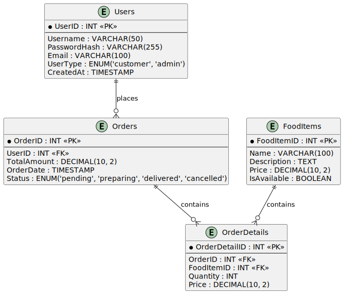
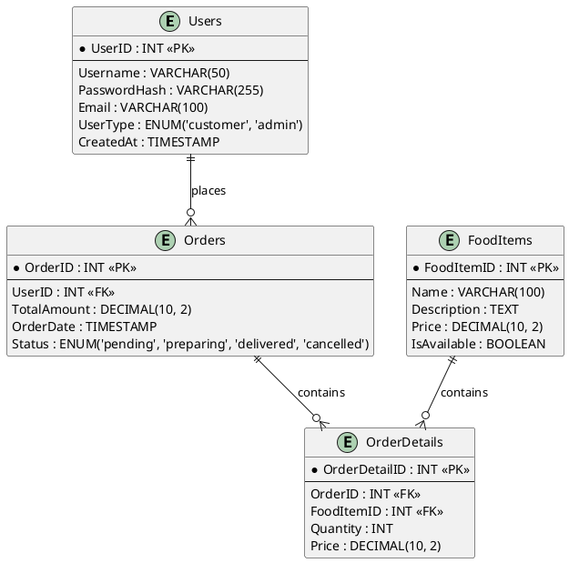

Here’s how you can create a markdown report that incorporates both the table design and the PlantUML diagram.

---

# Restaurant Order System - Database Design

## Introduction

This document outlines the database design for a restaurant order system. The system will manage users (both customers and admins), food items, and orders. It defines the structure of the database tables, the relationships between them, and includes an Entity-Relationship (ER) diagram for visualization.

## Tables

### 1. **Users Table**
This table stores information about both customers and admins.

| Column         | Type                        | Description                                      |
|----------------|-----------------------------|--------------------------------------------------|
| `UserID`       | `INT` (Primary Key)         | Unique identifier for each user.                 |
| `Username`     | `VARCHAR(50)`               | Username for the user.                           |
| `PasswordHash` | `VARCHAR(255)`              | Hashed password for secure login.                |
| `Email`        | `VARCHAR(100)`              | User's email address (must be unique).           |
| `UserType`     | `ENUM('customer', 'admin')` | Defines whether the user is a customer or admin. |
| `CreatedAt`    | `TIMESTAMP`                 | Automatically sets when the user is created.     |

### 2. **Food Items Table**
This table stores details about the food items available to order.

| Column        | Type                | Description                                                        |
|---------------|---------------------|--------------------------------------------------------------------|
| `FoodItemID`  | `INT` (Primary Key) | Unique identifier for each food item.                              |
| `Name`        | `VARCHAR(100)`      | Name of the food item (e.g., Pizza).                               |
| `Description` | `TEXT`              | Description of the food item.                                      |
| `Price`       | `DECIMAL(10, 2)`    | Price of the food item (e.g., 12.99).                              |
| `IsAvailable` | `BOOLEAN`           | Indicates if the item is available (true) or out of stock (false). |

### 3. **Orders Table**
This table stores information about each order placed by a customer.

| Column        | Type                                                     | Description                                         |
|---------------|----------------------------------------------------------|-----------------------------------------------------|
| `OrderID`     | `INT` (Primary Key)                                      | Unique identifier for each order.                   |
| `UserID`      | `INT`                                                    | Customer who placed the order (references `Users`). |
| `TotalAmount` | `DECIMAL(10, 2)`                                         | Total amount of the order (e.g., 50.75).            |
| `OrderDate`   | `TIMESTAMP`                                              | Date and time the order was placed.                 |
| `Status`      | `ENUM('pending', 'preparing', 'delivered', 'cancelled')` | Status of the order.                                |

### 4. **Order Details Table**
This table holds the specific food items for each order, linking orders and food items.

| Column          | Type                | Description                                     |
|-----------------|---------------------|-------------------------------------------------|
| `OrderDetailID` | `INT` (Primary Key) | Unique identifier for each detail record.       |
| `OrderID`       | `INT`               | The associated order (references `Orders`).     |
| `FoodItemID`    | `INT`               | The ordered food item (references `FoodItems`). |
| `Quantity`      | `INT`               | Number of units of the food item ordered.       |
| `Price`         | `DECIMAL(10, 2)`    | Price of the food item at the time of ordering. |

---

## ER Diagram

Below is the Entity-Relationship (ER) diagram representing the structure of the restaurant order system:

## Relationships Overview

- **Users to Orders**: One user can place many orders (1-to-many relationship).
- **Orders to OrderDetails**: One order can have many food items (1-to-many relationship).
- **OrderDetails to FoodItems**: Each order detail links to one food item (many-to-one relationship).

---